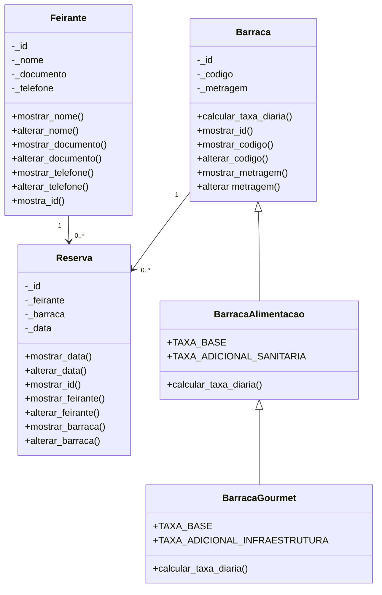

# Feira-POO

Sistema de feira de bairro desenvolvido em Python com FastAPI, seguindo os princípios de Programação Orientada a Objetos e separação por camadas.

## Visão geral

Este projeto simula uma API REST para gestão de reservas em uma feira de bairro, sem uso de banco de dados. Os dados são carregados a partir de mocks em memória e a lógica de negócio é organizada em modelos, controllers e rotas.

## Objetivo

- Gerenciar feirantes
- Controlar barracas e tipos de barraca
- Registrar reservas por data
- Validar regras de negócio
- Exibir histórico e faturamento

## Estrutura do projeto

```text
feira-de-bairro/
├── main.py
├── requirements.txt
├── verificar.py
├── README.md
├── guidelines.md
└── app/
    ├── __init__.py
    ├── data/
    ├── models/
    ├── controllers/
    └── routes/
```

## Requisitos

- Python 3.10+
- FastAPI
- Uvicorn

## Como executar

1. Crie um ambiente virtual:

```bash
python -m venv .venv
```

2. Ative o ambiente:

```bash
# Windows
.venv\Scripts\activate

# Linux/macOS
source .venv/bin/activate
```

3. Instale as dependências:

```bash
pip install -r requirements.txt
```

4. Inicie a aplicação:

```bash
uvicorn main:app --reload
```

5. Acesse a documentação interativa:

- `http://127.0.0.1:8000/docs`
- `http://127.0.0.1:8000/redoc`

Para executar as verificações automatizadas do projeto:

```bash
python verificar.py
```

## Rotas principais

| Método | Endpoint | Descrição | Status esperado |
|---|---|---|---|
| `GET` | `/api/barracas` | Lista todas as barracas | `200 OK` |
| `GET` | `/api/barracas/disponiveis` | Lista barracas disponíveis | `200 OK` |
| `GET` | `/api/barracas/{id}` | Detalhes da barraca | `200 OK` / `404` |
| `GET` | `/api/feirantes` | Lista todos os feirantes | `200 OK` |
| `GET` | `/api/feirantes/{id}` | Detalhes do feirante | `200 OK` / `404` |
| `POST` | `/api/reservas` | Cria uma reserva | `201 Created` / `409` / `422` |
| `GET` | `/api/feirantes/{id}/reservas` | Histórico de reservas do feirante | `200 OK` / `404` |
| `GET` | `/api/relatorio/faturamento` | Faturamento total | `200 OK` |

## Arquitetura e decisões técnicas

O projeto separa responsabilidades em quatro camadas:

- `app/data/` contém somente listas de dicionários usadas como dados iniciais. Não há banco de dados; alterações feitas durante a execução ficam em memória e são reiniciadas ao parar a aplicação.
- `app/models/` implementa as entidades e regras do domínio com Python puro. Atributos usam underscore, leituras passam por `mostrar_*()` e alterações validadas por `alterar_*()`. Erros de negócio são comunicados com `ValueError`.
- `app/controllers/` coordena os casos de uso, consulta as coleções, aplica regras de reserva e converte objetos para dicionários. Não conhece FastAPI nem códigos HTTP.
- `app/routes/` recebe e valida os dados HTTP, chama os controllers e traduz resultados e exceções para respostas HTTP.

A hierarquia `Barraca` → `BarracaAlimentacao` → `BarracaGourmet` calcula a taxa por sobrescrita polimórfica: a barraca comum cobra R$ 50,00; alimentação reutiliza a taxa base e soma R$ 30,00 de vigilância sanitária; gourmet reutiliza o cálculo anterior e soma R$ 40,00 de infraestrutura, totalizando R$ 120,00. O carregamento escolhe a classe pelo mapa `BARRACAS_TIPOS`, sem condicionais para distinguir subclasses.

Uma reserva associa os objetos `Feirante` e `Barraca` a uma data ISO (`AAAA-MM-DD`). O controller impede duplicidade de barraca/data e limita cada feirante a duas reservas. A disponibilidade exibida no catálogo indica se a barraca possui alguma reserva registrada.

Os IDs recebidos nas rotas devem ser positivos; o corpo de criação exige IDs inteiros positivos e data textual com até 10 caracteres. A validação de calendário da data é feita pelo modelo `Reserva`. As respostas distinguem criação (`201`), consulta (`200`), recurso ausente (`404`), conflito de regra (`409`) e entrada inválida (`422`).

### Criar uma reserva

Envie `barraca_id`, `feirante_id` e `data` no corpo JSON. A data deve usar o formato `AAAA-MM-DD`.

```json
{
  "barraca_id": 6,
  "feirante_id": 5,
  "data": "2026-11-01"
}
```

Uma reserva criada retorna `201 Created`; dados inexistentes retornam `404 Not Found`, conflitos de disponibilidade/limite retornam `409 Conflict` e dados inválidos retornam `422 Unprocessable Entity`.

## Diagrama de classes



## Divisão de tarefas

| Participante | Responsabilidade |
|---|---|
| Otávio | Dados mocks e classe `Feirante` |
| Nickolas | Hierarquia de barracas e classe `Reserva` |
| Pedro | Controllers e regras de negócio |
| Vinicius | Rotas, execução da API e documentação |

## Documentação complementar

- [guidelines.md](./guidelines.md) — especificação arquitetural e regras do projeto

## Observações

A implementação segue a regra de não usar `FastAPI` na camada de modelos, utilizando `ValueError` para validar regras de negócio e delegando o tratamento de status HTTP para as rotas.

## Verficar.py Saida

