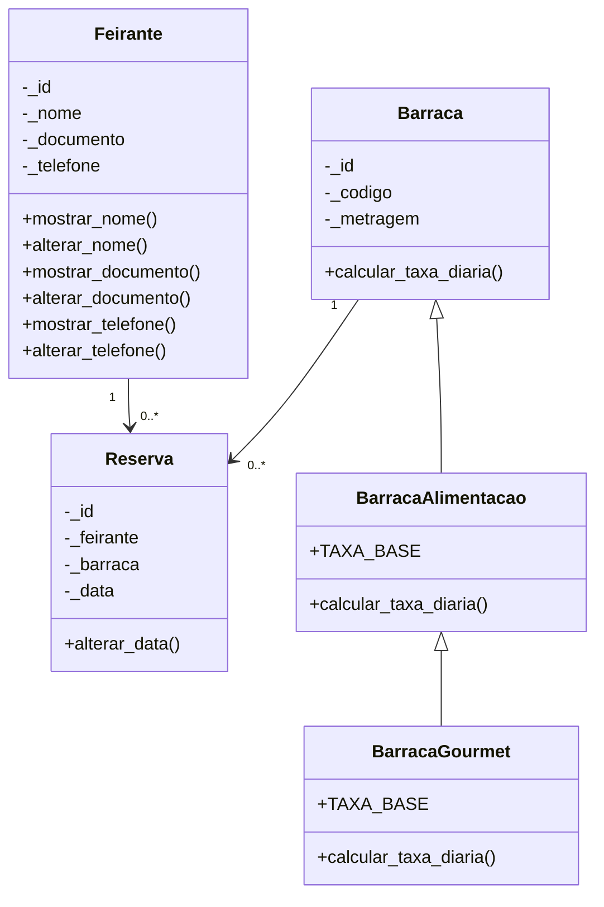

# Feira-POO

Sistema de feira de bairro desenvolvido em Python com FastAPI, seguindo os princípios de Programação Orientada a Objetos e separação por camadas.

## Visão geral

Este projeto simula uma API REST para gestão de reservas em uma feira de bairro, sem uso de banco de dados. Os dados são carregados a partir de mocks em memória e a lógica de negócio é organizada em modelos, controllers e rotas.

## Objetivo

- Gerenciar feirantes
- Controlar barracas e tipos de barraca
- Registrar reservas por data
- Validar regras de negócio
- Exibir histórico e faturamento

## Estrutura do projeto

```text
feira-de-bairro/
├── main.py
├── requirements.txt
├── verificar.py
├── README.md
├── guidelines.md
└── app/
    ├── __init__.py
    ├── data/
    ├── models/
    ├── controllers/
    └── routes/
```

## Requisitos

- Python 3.10+
- FastAPI
- Uvicorn

## Como executar

1. Crie um ambiente virtual:

```bash
python -m venv .venv
```

2. Ative o ambiente:

```bash
# Windows
.venv\Scripts\activate

# Linux/macOS
source .venv/bin/activate
```

3. Instale as dependências:

```bash
pip install -r requirements.txt
```

4. Inicie a aplicação:

```bash
uvicorn main:app --reload
```

5. Acesse a documentação interativa:

- `http://127.0.0.1:8000/docs`
- `http://127.0.0.1:8000/redoc`

## Rotas principais

| Método | Endpoint | Descrição | Status esperado |
|---|---|---|---|
| `GET` | `/api/barracas` | Lista todas as barracas | `200 OK` |
| `GET` | `/api/barracas/disponiveis` | Lista barracas disponíveis | `200 OK` |
| `GET` | `/api/barracas/{id}` | Detalhes da barraca | `200 OK` / `404` |
| `POST` | `/api/reservas` | Cria uma reserva | `201 Created` / `409` / `422` |
| `GET` | `/api/feirantes/{id}/reservas` | Histórico de reservas do feirante | `200 OK` / `404` |
| `GET` | `/api/relatorio/faturamento` | Faturamento total | `200 OK` |

## Diagrama de classes



## Divisão de tarefas

| Participante | Responsabilidade |
|---|---|
| Otávio | Dados mocks e classe `Feirante` |
| Nickolas | Hierarquia de barracas e classe `Reserva` |
| Pedro | Controllers e regras de negócio |
| Vinicius | Rotas, execução da API e documentação |

## Documentação complementar

- [guidelines.md](./guidelines.md) — especificação arquitetural e regras do projeto

## Observações

A implementação segue a regra de não usar `FastAPI` na camada de modelos, utilizando `ValueError` para validar regras de negócio e delegando o tratamento de status HTTP para as rotas.

